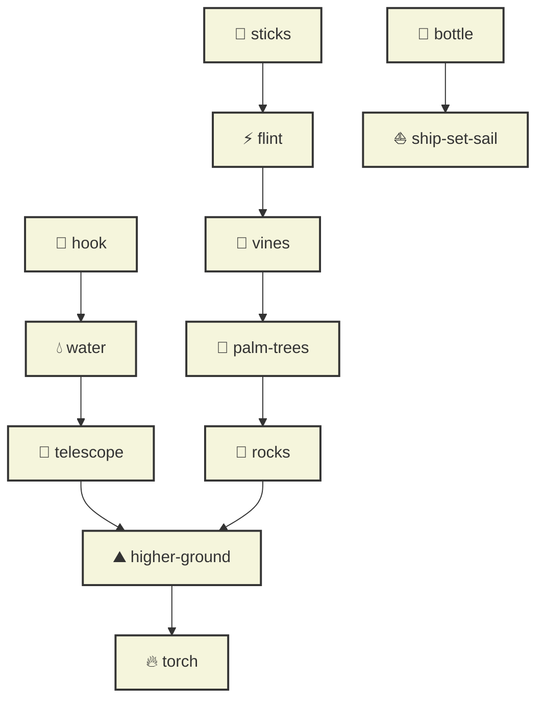
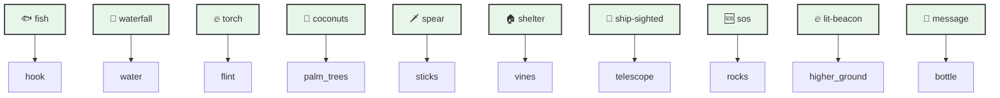

# Граф зависимостей карт

## Карты тыльной стороны (INITIAL_DECK)

## Карты лицевой стороны (INITIAL_FRONT_DECK)

## Легенда
- 🎣 hook - Крюк
- 💧 water - Вода
- 🔭 telescope - Телескоп
- ⛰️ higher-ground - Возвышенность
- 🔥 torch - Факел
- ⚡ flint - Кремень
- 🌿 vines - Лозы
- 🌴 palm-trees - Пальмы
- 🧱 rocks - Камни
- 🥢 sticks - Палки
- 🍾 bottle - Бутылка
- ⛵ ship-set-sail - Корабль

### Карты лицевой стороны
- 🐟 fish - Рыба
- 🌊 waterfall - Водопад
- 🔥 torch - Факел
- 🥥 coconuts - Кокосы
- 🗡️ spear - Копье
- 🏠 shelter - Укрытие
- 🚢 ship-sighted - Замеченный корабль
- 🆘 sos - SOS
- 🔥 lit-beacon - Зажженный маяк
- 📜 message - Сообщение 