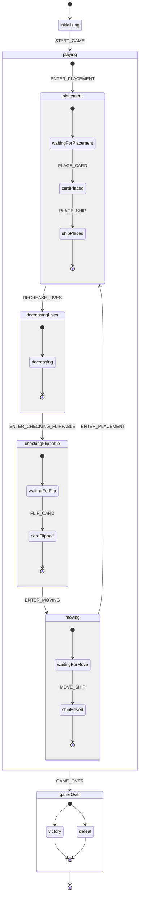

# Диаграмма состояний игры

## Описание состояний

### Основные состояния
- `initializing` - Начальное состояние игры
- `playing` - Игровой процесс
- `gameOver` - Конец игры

### Состояния внутри playing
1. **placement** (Размещение)
   - `waitingForPlacement` - Ожидание размещения карты
   - `cardPlaced` - Карта размещена
   - `shipPlaced` - Корабль размещен

2. **decreasingLives** (Уменьшение жизней)
   - `decreasing` - Процесс уменьшения жизней

3. **checkingFlippable** (Проверка переворота)
   - `waitingForFlip` - Ожидание переворота карты
   - `cardFlipped` - Карта перевернута

4. **moving** (Движение)
   - `waitingForMove` - Ожидание движения корабля
   - `shipMoved` - Корабль сдвинут

### Состояния gameOver
- `victory` - Победа
- `defeat` - Поражение

## События
- `START_GAME` - Начало игры
- `ENTER_PLACEMENT` - Вход в фазу размещения
- `PLACE_CARD` - Размещение карты
- `PLACE_SHIP` - Размещение корабля
- `DECREASE_LIVES` - Уменьшение жизней
- `ENTER_CHECKING_FLIPPABLE` - Вход в фазу проверки переворота
- `FLIP_CARD` - Переворот карты
- `ENTER_MOVING` - Вход в фазу движения
- `MOVE_SHIP` - Движение корабля
- `GAME_OVER` - Конец игры 