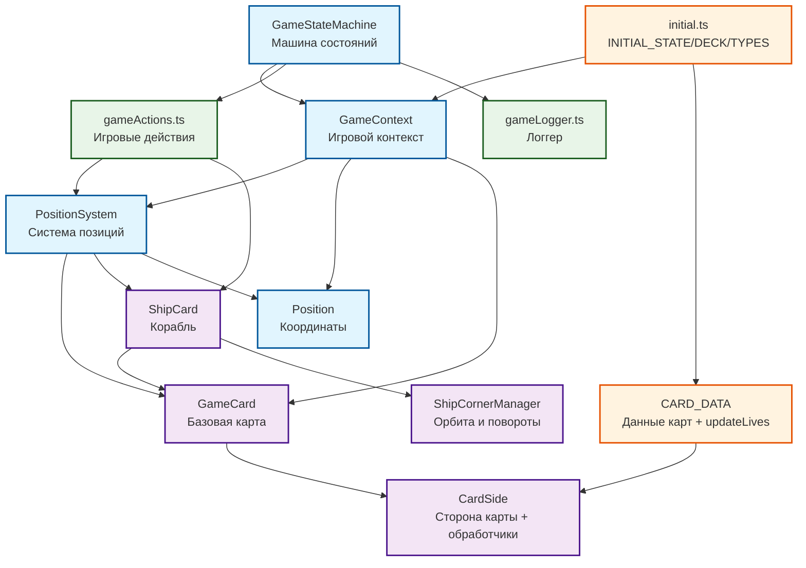

# Схема связей сущностей игры Save Oneself (актуальная версия)

## Диаграмма связей (Mermaid)

## Описание актуальных связей

### 1) Основные сущности

- **GameContext** (`src/core/initial.ts`):
  - `lives: number` - количество жизней (0-16)
  - `deck: GameCard[]` - колода карт
  - `positionSystem: PositionSystem` - система управления позициями
  - `playerPosition?: Position` - текущая позиция игрока
  - `hasPlacedCard: boolean`, `hasMoved: boolean`, `movesLeft: number` - флаги состояния хода
  - `gameOverMessage: string | null`, `isVictory: boolean` - состояние игры
  - `showStartTooltip: boolean` - показывать ли подсказку

- **GameStateMachine** (`src/core/gameStateMachine.ts`):
  - Использует XState для управления состояниями
  - Инициализируется `INITIAL_STATE`
  - Управляет фазами: `startOfRound` → `moving` → `checkingCardPlacement` → `placingCardAndShip` → `checkingCardEffects` → `checkingMoveResult` → `decreasingLives` → `checkingFlippable` → `shipMoving`
  - При входе в `playing` колода перемешивается один раз
  - Вызывает обработчики сторон карт: `onRoundStart`, `onPlace`, `afterPlace`, `onBeforeShipMove`, `onShipMove`

### 2) Система карт

- **CardSide** (`src/core/Card.ts`): описывает сторону карты и содержит обработчики:
  - `id`, `lives`, `direction`, `requirements`, `type`, `emoji`, `description`, `score`
  - Обработчики: `onPlace`, `afterPlace`, `onBeforeShipMove`, `onShipMove`, `onRoundStart`
  - `canActivate` - проверка возможности переворота

- **GameCard** (`src/core/Card.ts`):
  - Две стороны (`backSide`/`frontSide`), переключается через `flip()`
  - Методы доступа к текущим свойствам: `getCurrentId()`, `getCurrentEmoji()`, `getCurrentType()`, `getCurrentDirection()`, `getCurrentLives()`, `getCurrentScore()`
  - Базовая реализация `canActivate()` учитывает требования через `PositionSystem`

- **ShipCard** (`src/core/ShipCard.ts`):
  - Наследуется от `GameCard`, хранит `ShipCornerManager`
  - Флаги `skipMove`, `hasTurned` для управления поведением
  - Методы: `getCurrentDirection()`, `getEmoji()`, `getCurrentType()`

- **ShipCornerManager** (`src/core/ShipCornerManager.ts`):
  - Рассчитывает "квадрат острова" по текущим границам поля
  - Валидирует орбиту и позиции корабля
  - Определяет повороты на углах: `getNextDirection()`, `isFinalCornerShipPosition()`
  - Управляет движением: `getStartShipPosition()`, `getNextShipPosition()`
  - Проверки: `isPlayerValidPosition()`, `isShipOutOfBounds()`, `isIslandCornerCard()`

### 3) Позиции

- **PositionSystem** (`src/core/PositionSystem.ts`):
  - Хранит карты по ключу строки координат (`occupiedPositions: Map<string, GameCard>`)
  - Оперирует картами: `getCard()`, `setPosition()`, `removePosition()`, `hasPosition()`
  - Работа с кораблем: `getShipPosition()`, `getShipCard()`, `moveShip()`, `removeShipPosition()`
  - Поиск и фильтрация: `findCardById()`, `findAllBy()`, `findFarthestPosition()`
  - Геометрия: `getBounds()`, `getAdjacentPositions()`, `isAdjacent()`, `isOutOfBounds()`
  - Утилиты: `countNonShipCards()`, `clone()`, `swapPositions()`

- **Position**: простая структура координат с утилитами:
  - `toString()`, `fromString()`, `equals()`, `distanceTo()`, `isValid()`

### 4) Данные, инициализация, действия

- **CARD_DATA** (`src/core/cardData.ts`):
  - Описание всех карт (back/front) и их обработчиков
  - 15 типов карт: `vines`, `hook`, `water`, `flint`, `palmTrees`, `sticks`, `bottle`, `higherGround`, `telescope`, `rocks`, `pig`, `storm`, `mirage`, `pirates`, `mapRow`, `mapCol`
  - Функция `updateLives(oldLives, delta)` централизует изменение жизней (0..16)
  - Отдельная карта `ship` для корабля

- **initial.ts**:
  - Типы: `GameContext`, `GameEvent`, `GameState`
  - `BACK_CARDS`, `INITIAL_GAME_DECK` создаются из `CARD_DATA`
  - `INITIAL_STATE` формирует стартовый контекст с 16 жизнями

- **gameActions.ts**:
  - `shuffleDeck()` - перемешивание колоды
  - `movePlayer()` - перемещение игрока с проверками
  - `placeCard()` - размещение карты на поле
  - `placeShip()` - размещение корабля с `ShipCornerManager`
  - `moveShip()` - движение корабля по орбите
  - `decreaseLive()` - уменьшение жизней
  - `isPlayerValidPosition()` - валидация позиции игрока
  - `hasFlippableCards()` - проверка наличия переворачиваемых карт
  - `checkVictory()` - проверка условий победы (SOS, маяк, сообщение) — в текущей машине состояния победу устанавливают эффекты карт в `onShipMove`
  - `checkDefeat()` - проверка поражения (корабль вне границ)
  - `calculateScore()` - подсчет итогового счета

### 5) Поток раунда (детальный)

1. **`startOfRound`**: сброс флагов `hasPlacedCard`, `hasMoved`, вызов `onRoundStart` для всех карт
2. **`moving`**: игрок делает шаг (`MOVE_PLAYER`) или пропускает ходы (`SKIP_MOVES`)
3. **`checkingCardPlacement`**: если клетка пустая и карта не размещена — `placeCard()`, потенциально `placeShip()`
4. **`checkingCardEffects`**: вызов `onPlace` только для текущей клетки, затем глобальный `afterPlace`
5. **`checkingMoveResult`**: проверка победы/поражения, иначе уменьшение жизней
6. **`decreasingLives`**: уменьшение жизней на 1 (с задержкой 500ms до переходов)
7. **`checkingFlippable`**: по желанию игрока `ACTIVATE_CARD` для переворачиваемых карт
8. **`shipMoving`**: 
   - Вызов `onBeforeShipMove` для всех карт
   - Движение корабля через `moveShip()`
   - Вызов `onShipMove` для всех карт (именно здесь эффекты карт формируют `gameOverMessage`/`isVictory`)
   - Проверка поражения по кораблю (`checkDefeat()`); при отсутствии завершения — переход к `startOfRound`

### 6) Особенности обработчиков карт

- **`onPlace`**: срабатывает при размещении/перевороте карты
- **`afterPlace`**: дополнительные эффекты сразу после `onPlace` (глобально для всех карт и инвентаря)
- **`onBeforeShipMove`**: срабатывает перед движением корабля (телескоп, пираты)
- **`onShipMove`**: срабатывает после движения корабля (морской змей)
- **`onRoundStart`**: срабатывает в начале раунда (шторм, компас)
- **`canActivate`**: проверяет условия для переворота (бутылка, карты карты, телескоп, камни)

## Примечания по архитектуре

- **Отсутствие циклических зависимостей**: `gameActions` импортирует `updateLives` из `cardData`, но `cardData` не зависит от `gameActions`
- **Сознательная связанность `PositionSystem ↔ ShipCard`**: валидация позиций корабля делегирована `ShipCornerManager` через `ShipCard`
- **Обработчики на `CardSide`** формируют игровые сценарии:
  - Телескоп: поворот корабля на углу один раз
  - Пираты: перехват корабля до движения
  - Мираж: замена дальней карты и flip
  - Шторм/торнадо: условные flip-эффекты
  - Карты карты: поиск сокровища по пересечению
  - Бутылка: отправка сообщения при остановке корабля

## Возможные улучшения

- Вынести `updateLives` в отдельный модуль эффектов при появлении других общих эффектов
- Рассмотреть ослабление зависимости `PositionSystem` от `ShipCard` через интерфейс при необходимости альтернативной реализации
- Документировать контракт обработчиков `CardSide` и их сроки вызова в отдельном разделе руководства