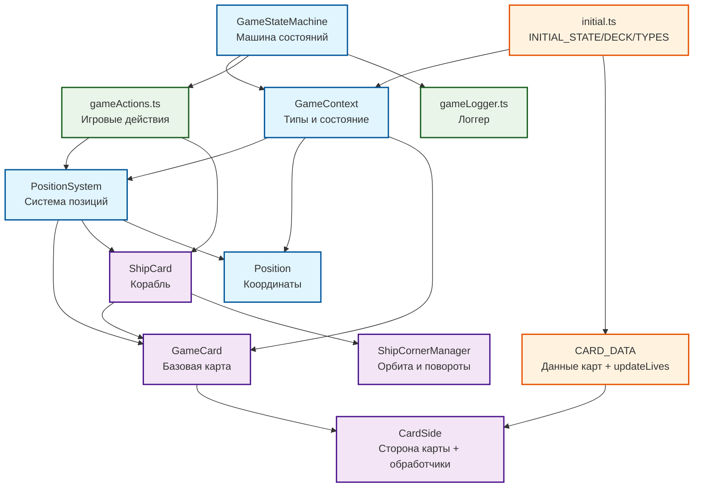

# Схема связей сущностей игры Marooned (актуальная)

## Диаграмма связей (Mermaid)

## Описание актуальных связей

### 1) Основные сущности

- **GameContext** (`src/core/initial.ts`):
  - `lives: number`
  - `deck: GameCard[]`
  - `positionSystem: PositionSystem`
  - `playerPosition?: Position`
  - `hasPlacedCard: boolean`, `hasMoved: boolean`, `movesLeft: number`
  - `gameOverMessage: string | null`, `isVictory: boolean`

- **GameStateMachine** (`src/core/gameStateMachine.ts`):
  - Инициализируется `INITIAL_STATE`
  - Управляет фазами: startOfRound → moving → checkingCardPlacement → checkingCardEffects → checkingMoveResult → decreasingLives → checkingFlippable → shipMoving → checkingShipEffects
  - Вызовы обработчиков сторон карт: `onRoundStart`, `onPlace` (только для текущей клетки), `onBeforeShipMove`, `onShipMove`

### 2) Система карт

- **CardSide** (`src/core/Card.ts`): описывает сторону карты и содержит обработчики:
  - `onPlace`, `onFlip`, `onBeforeShipMove`, `onShipMove`, `onRoundStart`, а также `canFlip`

- **GameCard** (`src/core/Card.ts`):
  - Две стороны (back/front), переключается `flip`
  - Методы доступа к текущим свойствам (id, emoji, type, direction, lives/score)
  - Базовая реализация `canFlip` учитывает требования (`requirements`) через `PositionSystem`

- **ShipCard** (`src/core/ShipCard.ts`):
  - Наследуется от `GameCard`, хранит текущее направление и `ShipCornerManager`
  - Флаги `skipMove`, `hasTurned`

- **ShipCornerManager** (`src/core/ShipCornerManager.ts`):
  - Рассчитывает «квадрат острова» по текущим границам
  - Валидирует орбиту и стартовую/следующую позицию корабля, определяет повороты на углах

### 3) Позиции

- **PositionSystem** (`src/core/PositionSystem.ts`):
  - Хранит карты по ключу строки координат
  - Оперирует картами/кораблем: `getShipPosition/Card`, `set/remove/swap`, `findCardById`, `findAllBy`, `getBounds`, `getAdjacentPositions`, `isAdjacent`, `isOutOfBounds`, `countNonShipCards`, `clone`
  - Знает о `ShipCard` (валидация позиций корабля через `cornerManager`)

- **Position**: простая структура координат с утилитами (`toString`, `fromString`, `distanceTo`, `equals`, `isValid`)

### 4) Данные, инициализация, действия

- **CARD_DATA** (`src/core/cardData.ts`):
  - Описание всех карт (back/front) и их обработчиков
  - Функция `updateLives(oldLives, delta)` централизует изменение жизней (0..16)

- **initial.ts**:
  - Типы `GameContext`, `GameEvent`, `GameState`
  - `INITIAL_GAME_DECK` создаётся из `CARD_DATA`
  - `INITIAL_STATE` формирует стартовый контекст

- **gameActions.ts**:
  - `shuffleDeck`, `movePlayer`, `placeCard`, `placeShip`, `moveShip`, `decreaseLive`, `isPlayerValidPosition`, `hasFlippableCards`, `checkVictory`, `checkDefeat`, `calculateScore`
  - Взаимодействует с `PositionSystem`, `ShipCard`, `ShipCornerManager`; использует `updateLives` из `cardData`

### 5) Поток раунда (кратко)

1. `startOfRound`: сброс флагов, `onRoundStart` для всех карт
2. `moving`: игрок делает шаг (`MOVE_PLAYER`) или пропускает остаток ходов
3. `checkingCardPlacement`: если клетка пустая и карта не размещена — `placeCard` (+ потенциально `placeShip`)
4. `checkingCardEffects`: `onPlace` только для текущей клетки
5. `checkingMoveResult`: проверка победы/ходов; иначе — уменьшение жизней
6. `decreasingLives` → `checkingFlippable` (по желанию `FLIP_CARD`) → `shipMoving`
7. `shipMoving`: `onBeforeShipMove`, движение корабля, затем проверка победы/поражения и `onShipMove`

## Примечания по текущей архитектуре

- **Циклических зависимостей нет**: `gameActions` импортирует `updateLives` из `cardData`, а `cardData` не зависит от `gameActions`.
- **Сознательная связанность `PositionSystem ↔ ShipCard`**: валидация позиций корабля делегирована `ShipCornerManager` через `ShipCard`.
- **Обработчики на `CardSide`** формируют сценарии: телескоп (поворот на углу один раз), пираты (перехват до движения), мираж (замена дальней карты и flip), шторм/торнадо (условные flip-эффекты), карты карты (map-r/map-c) и т.п.

## Возможные улучшения (необязательные)

- Вынести `updateLives` в отдельный модуль эффектов, если появятся другие общие эффекты
- Рассмотреть ослабление зависимости `PositionSystem` от `ShipCard` через интерфейс уровня «корабля», если потребуется альтернативная реализация
- Документировать контракт обработчиков `CardSide` и их сроки вызова в отдельном разделе руководства

